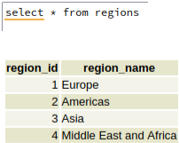
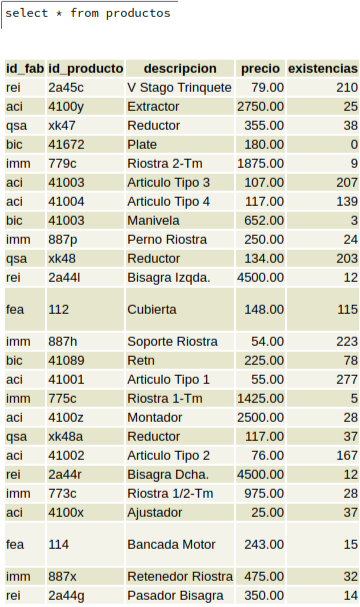
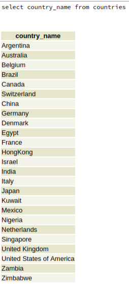
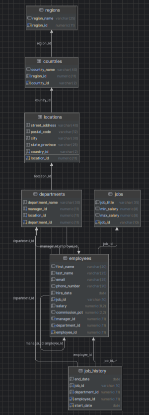
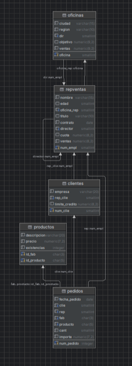

# Bases de dades

A la WorkShop de base de dades em apres a crear bases de dades i realitzar comandes basiques per cercar informació

En aquesta activitat vam tenir que crear-nos una compta d'AlwaysData, la qual vam utilitzar per a crear dos bases de dades, la primera per importar un arxiu anomenat "hr" i la segona per un arxiu anomenat "training", quan les vam tenir creades, vam fer algunes consultes com:

per la BBDD "hr", on consultem per tot el que hi ha a la taula "regions",

per la BBDD "training", on consultem per tot el que hi ha a la taula "productos",

per la BBDD "hr", on consultem els noms de tots els països de la taula "countries".

Despres vam crear un nou usuari al qual li vam donar permisos nomes per la BBDD de "training", amb aquest usuari vam comprobar que funciones tant els permisos que li haviem proporcionat d'acces, edició, i consultes.

Despres de fer totes aquestes proves amb AlwaysData, vam desplegar el DataGrip, amb el qual vam establir una connexió a la base de dades de "hr", amb el primer usuari que vam crear, i despres una altre connexió a la base de dades de "training" amb l'ultim usuari creat. Amb aquesta eina vam tornar a provar a fer consultes basiques per veure si funcionaba. 

Finalment amb una eina que ens proporcionaba el DataGrip vam crear els diagrames Entitat-Relació de les dues bases de dades:

Training:

HR:

